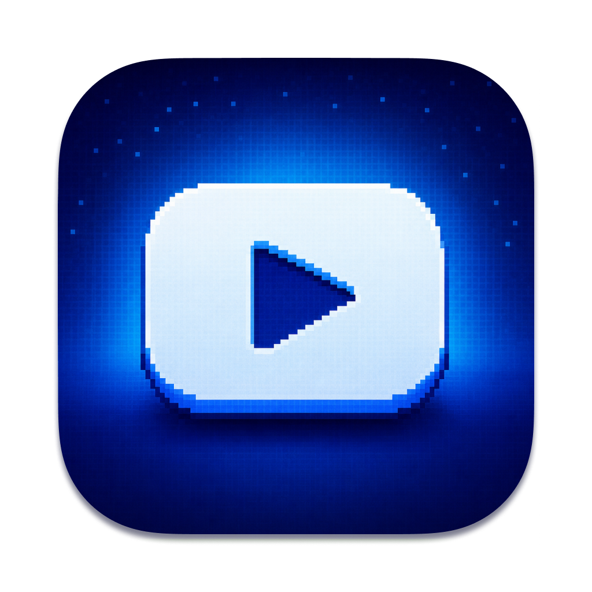

# YouTubeJack

<p align="center">
  
</p>

**Native macOS YouTube downloader.** Paste a video or playlist link, preview it, choose an available resolution and format, then download through a simple native queue.

<p align="center">
  <a href="https://github.com/burakereno/youtubejack/releases/latest/download/YouTubeJack.dmg">
    
  </a>
  &nbsp;
  <a href="https://github.com/burakereno/youtubejack/releases/latest">
    
  </a>
</p>

<p align="center">
  <sub>macOS 14.0+ · bundled yt-dlp and ffmpeg · Developer ID signed and notarized</sub>
</p>

## Features

- **Native preview** — paste a YouTube video or playlist URL and fetch title, channel, duration, and thumbnail
- **Resolution-aware choices** — only available video resolutions and container formats are enabled
- **MP4 / WebM handling** — preserves high-quality WebM where needed and uses MP4 when available
- **Playlist support** — select all, clear selection, and queue many playlist entries at once
- **Queue control** — start, pause, remove, retry, and drag-drop reorder downloads
- **File cleanup** — cancelled and failed partial downloads are cleaned without touching unrelated files
- **Bundled runtime tools** — ships with yt-dlp and ffmpeg, so users do not need Homebrew
- **yt-dlp updates** — app-managed yt-dlp updates keep the downloader current
- **One-click app updates** — checks GitHub releases, downloads the latest DMG, and installs it
- **Native macOS** — SwiftUI app, Developer ID release workflow, polished drag-to-Applications DMG

## Installation

### Download DMG

1. Go to the [Releases](../../releases/latest) page
2. Download **`YouTubeJack.dmg`**
3. Open the DMG and drag **YouTubeJack.app** to your **Applications** folder

Release downloads are Developer ID signed and notarized. Use YouTubeJack only for media you have the right to download.

## Build from Source

### Requirements

- macOS 14.0+
- Xcode 16.0+
- Swift Package Manager

### Steps

```bash
git clone https://github.com/burakereno/youtubejack.git
cd youtubejack

swift test
./scripts/build-app.sh
open ".build/YouTubeJack.app"
```

`scripts/build-app.sh` prepares bundled runtime tools before staging the `.app` bundle. At runtime YouTubeJack resolves tools in this order:

1. `~/Library/Application Support/YouTubeJack/bin`
2. `YouTubeJack.app/Contents/Resources/bin`

The first location is used for app-managed yt-dlp updates.

## Tech Stack

- **SwiftUI** — native window and settings UI
- **AppKit** — app lifecycle, Finder reveal, update installer handoff
- **Swift Package Manager** — build system
- **yt-dlp / ffmpeg** — metadata extraction, download, merge, and remux
- **GitHub Releases** — app update checks and DMG distribution

Release signing setup is documented in [docs/release-signing.md](docs/release-signing.md).
